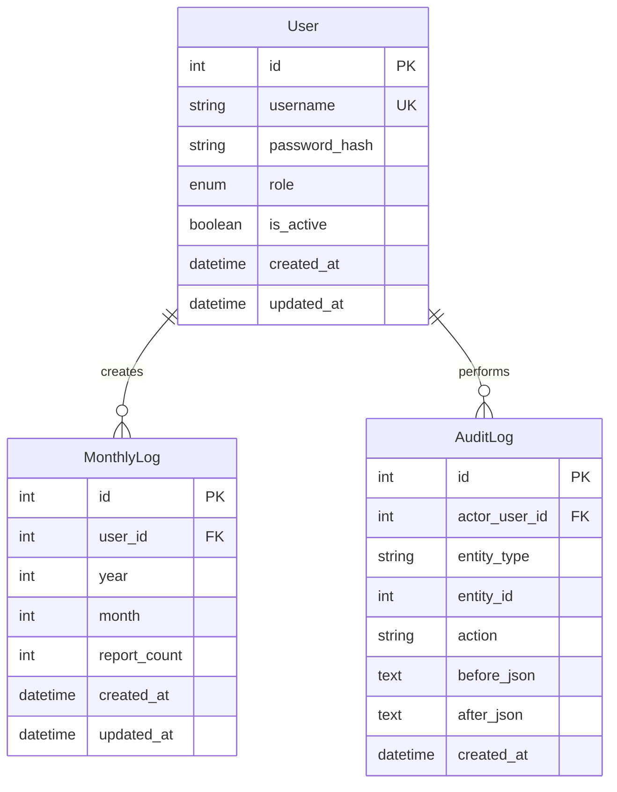
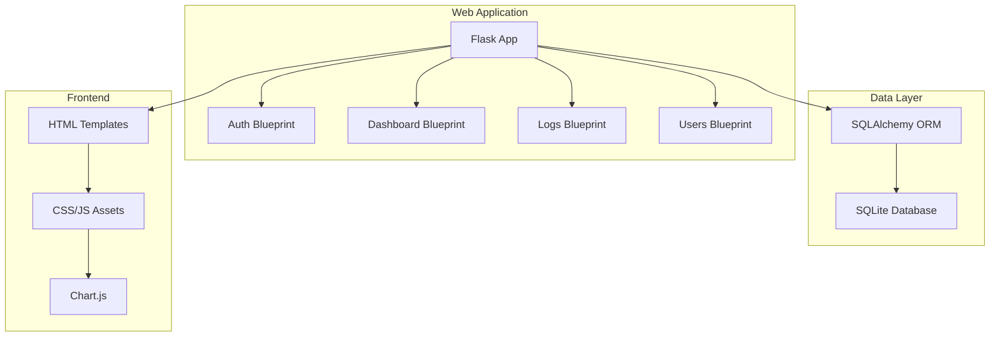
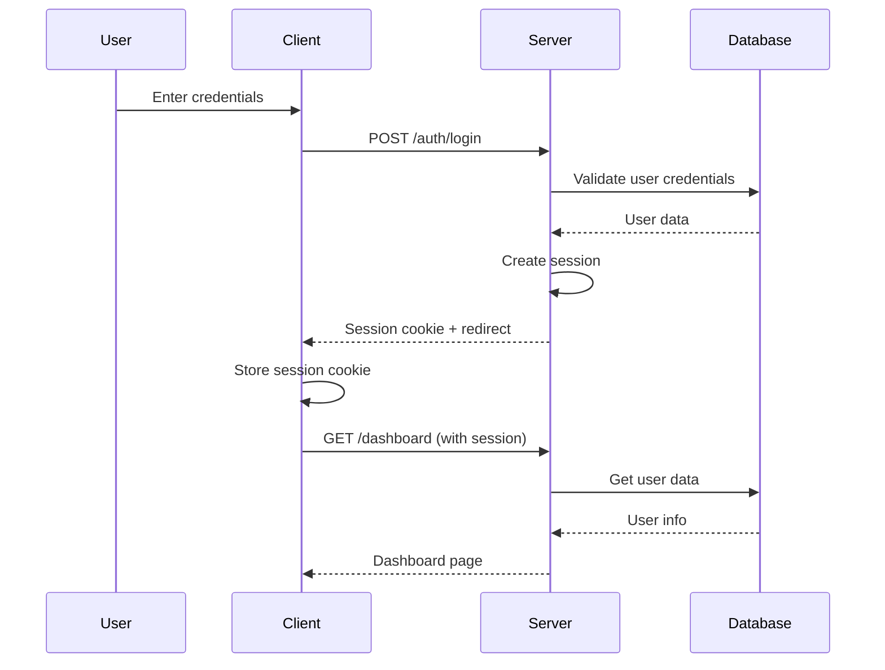
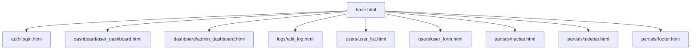

# Medication Error Statistics Tracker - Complete Project Plan

**Date:** 2026-03-03  
**Version:** 1.0  
**Owner:** Director of Medication Error  
**Status:** Architecture Complete - Ready for Implementation  

---

## Table of Contents

1. [Executive Summary](#1-executive-summary)
2. [System Requirements](#2-system-requirements)
3. [Technology Stack](#3-technology-stack)
4. [Data Model Design](#4-data-model-design)
5. [Application Architecture](#5-application-architecture)
6. [API Design](#6-api-design)
7. [Frontend Architecture](#7-frontend-architecture)
8. [Security Architecture](#8-security-architecture)
9. [Development Setup](#9-development-setup)
10. [Production Deployment](#10-production-deployment)
11. [Testing Strategy](#11-testing-strategy)
12. [Monitoring & Maintenance](#12-monitoring--maintenance)
13. [Implementation Timeline](#13-implementation-timeline)
14. [Future Enhancements](#14-future-enhancements)

---

## 1. Executive Summary

This document provides a comprehensive project plan for the Medication Error Statistics Tracker web application. The system enables staff to log monthly report counts for drug naming and packaging evaluations, with role-based access control and performance visualization.

### Core Objectives

- **Replace manual spreadsheet workflows** with structured, auditable data
- **Enable staff** to log their monthly report counts
- **Provide administrators** with performance visualization and comparison tools
- **Maintain simplicity** while ensuring security and scalability

### Key Features

| Feature | Description |
|---------|-------------|
| **Monthly Report Logging** | Staff submit report counts per month |
| **Role-based Access** | Regular Users (own data) + Admin (all data) |
| **Performance Visualization** | Personal dashboards with charts |
| **User Management** | Admin creates/manages staff accounts |
| **Audit Trail** | Complete history of all changes |

---

## 2. System Requirements

### 2.1 Functional Requirements

#### Regular Staff Features
- Login/logout with username and password
- View personal dashboard with performance metrics
- Add monthly report counts
- Edit own reports for any month
- View historical performance trends

#### Admin Features
- All regular staff features
- View all staff performance dashboards
- Compare staff performance
- Create/edit/deactivate staff accounts
- Add/edit logs for any user

### 2.2 Non-Functional Requirements

| Requirement | Specification |
|-------------|---------------|
| **Reliability** | No data loss on normal save operations |
| **Performance** | Dashboard responses should feel immediate |
| **Maintainability** | Clean module boundaries and testable code |
| **Traceability** | Every sensitive write action is auditable |
| **Security** | Password hashing, session management, CSRF protection |

### 2.3 System Requirements

| Requirement | Minimum | Recommended |
|-------------|---------|-------------|
| **Operating System** | Windows 10/11, Ubuntu 18.04+, macOS 10.14+ | Latest stable |
| **Python** | 3.9+ | 3.11+ |
| **Memory** | 2GB RAM | 4GB+ RAM |
| **Storage** | 1GB free space | 5GB+ free space |

---

## 3. Technology Stack

### 3.1 Technology Overview

| Layer | Technology | Purpose |
|-------|------------|---------|
| **Backend** | Python 3.9+ | Core application logic |
| | Flask | Web framework |
| | SQLAlchemy | ORM for database operations |
| | Flask-Login | Session management |
| | Flask-WTF | Form handling and CSRF |
| | Flask-Migrate | Database migrations |
| **Database** | SQLite | Simple file-based database |
| **Frontend** | HTML5 + Jinja2 | Server-rendered templates |
| | CSS3 | Styling |
| | JavaScript | Client-side interactions |
| | Chart.js | Data visualization |
| **Deployment** | Gunicorn | WSGI server |
| | Nginx | Reverse proxy |

### 3.2 Python Dependencies

```txt
# Web Framework
Flask==2.3.3
Flask-SQLAlchemy==3.0.5
Flask-Login==0.6.3
Flask-WTF==1.1.1
Flask-Migrate==4.0.5

# Database
SQLAlchemy==2.0.21

# Forms & Validation
WTForms==3.0.1
email-validator==2.0.0

# Security
bcrypt==4.0.1

# Development & Testing
pytest==7.4.2
pytest-flask==1.2.0
pytest-cov==4.1.0
black==23.7.0
flake8==6.0.0

# Production Server
gunicorn==21.2.0

# Utilities
python-dotenv==1.0.0
```

---

## 4. Data Model Design

### 4.1 Database Schema Overview



### 4.2 SQLAlchemy Models

#### User Model

```python
class User(db.Model):
    __tablename__ = 'users'
    
    id = db.Column(db.Integer, primary_key=True)
    username = db.Column(db.String(80), unique=True, nullable=False)
    password_hash = db.Column(db.String(255), nullable=False)
    role = db.Column(db.Enum('admin', 'user'), nullable=False, default='user')
    is_active = db.Column(db.Boolean, default=True)
    created_at = db.Column(db.DateTime, default=datetime.utcnow)
    updated_at = db.Column(db.DateTime, default=datetime.utcnow, onupdate=datetime.utcnow)
    
    monthly_logs = db.relationship('MonthlyLog', backref='user', lazy=True)
```

#### MonthlyLog Model

```python
class MonthlyLog(db.Model):
    __tablename__ = 'monthly_logs'
    
    id = db.Column(db.Integer, primary_key=True)
    user_id = db.Column(db.Integer, db.ForeignKey('users.id'), nullable=False)
    year = db.Column(db.Integer, nullable=False)
    month = db.Column(db.Integer, nullable=False)  # 1-12
    report_count = db.Column(db.Integer, nullable=False, default=0)
    created_at = db.Column(db.DateTime, default=datetime.utcnow)
    updated_at = db.Column(db.DateTime, default=datetime.utcnow, onupdate=datetime.utcnow)
    
    __table_args__ = (db.UniqueConstraint('user_id', 'year', 'month'),)
```

#### AuditLog Model

```python
class AuditLog(db.Model):
    __tablename__ = 'audit_logs'
    
    id = db.Column(db.Integer, primary_key=True)
    actor_user_id = db.Column(db.Integer, db.ForeignKey('users.id'), nullable=False)
    entity_type = db.Column(db.String(50), nullable=False)
    entity_id = db.Column(db.Integer, nullable=False)
    action = db.Column(db.String(50), nullable=False)
    before_json = db.Column(db.Text)
    after_json = db.Column(db.Text)
    created_at = db.Column(db.DateTime, default=datetime.utcnow)
```

### 4.3 Database Rules

- **Unique constraint** on (`user_id`, `year`, `month`) in MonthlyLog
- **Soft delete** for users (is_active flag)
- **Audit trail** for all data changes
- **Timestamps** on all records for tracking

---

## 5. Application Architecture

### 5.1 Architecture Pattern

**Modular Monolith** with Flask Blueprints



### 5.2 Directory Structure

```
me_statistics/
├── app/
│   ├── __init__.py              # Flask app factory
│   ├── config.py                # Configuration settings
│   ├── extensions.py            # Initialize extensions
│   ├── models/
│   │   ├── __init__.py
│   │   ├── user.py
│   │   ├── monthly_log.py
│   │   └── audit_log.py
│   ├── auth/
│   │   ├── __init__.py
│   │   ├── routes.py
│   │   ├── forms.py
│   │   └── decorators.py
│   ├── dashboard/
│   │   ├── __init__.py
│   │   ├── routes.py
│   │   └── services.py
│   ├── logs/
│   │   ├── __init__.py
│   │   ├── routes.py
│   │   └── forms.py
│   ├── users/
│   │   ├── __init__.py
│   │   ├── routes.py
│   │   └── forms.py
│   ├── templates/
│   │   ├── base.html
│   │   ├── auth/
│   │   ├── dashboard/
│   │   ├── logs/
│   │   └── users/
│   └── static/
│       ├── css/
│       ├── js/
│       └── img/
├── migrations/                  # Database migrations
├── tests/
├── requirements.txt
├── run.py                       # Application entry point
├── .env                         # Environment variables
└── README.md
```

### 5.3 Blueprint Organization

| Blueprint | Purpose | Routes |
|-----------|---------|--------|
| **auth** | Authentication | `/login`, `/logout` |
| **dashboard** | User dashboards | `/dashboard`, `/dashboard/admin` |
| **logs** | Monthly log management | `/logs/me`, `/logs/<user_id>` |
| **users** | User management (admin) | `/users`, `/users/<id>` |

### 5.4 Roles and Access Matrix

| Permission | Regular User | Admin |
|------------|--------------|-------|
| Login/logout | ✅ | ✅ |
| View own dashboard | ✅ | ✅ |
| Create/edit own logs | ✅ | ✅ |
| View admin dashboard | ❌ | ✅ |
| View all staff performance | ❌ | ✅ |
| Compare staff | ❌ | ✅ |
| Manage user accounts | ❌ | ✅ |
| Edit any user's logs | ❌ | ✅ |

---

## 6. API Design

### 6.1 Authentication Flow



### 6.2 Route Specifications

#### Authentication Routes

```
GET  /auth/login          - Login page
POST /auth/login          - Process login
POST /auth/logout         - Logout user
```

#### Dashboard Routes

```
GET  /dashboard           - User dashboard (regular users)
GET  /dashboard/admin     - Admin dashboard (admin only)
```

#### Log Management Routes

```
GET  /logs/me             - User's monthly logs
GET  /logs/me/edit        - Edit user's log form
POST /logs/me/edit        - Process log update
GET  /logs/<user_id>/edit - Admin edit user log
POST /logs/<user_id>/edit - Admin process log update
```

#### User Management Routes (Admin Only)

```
GET  /users               - List all users
GET  /users/new           - Create user form
POST /users/new           - Create new user
GET  /users/<id>/edit     - Edit user form
POST /users/<id>/edit     - Update user
POST /users/<id>/toggle   - Activate/deactivate user
```

#### System Routes

```
GET  /health              - Health check endpoint
```

---

## 7. Frontend Architecture

### 7.1 Template Hierarchy



### 7.2 Dashboard Components

#### User Dashboard
- **Current Month Summary Card**: Reports submitted this month
- **Quick Add Form**: Month dropdown + Report count + Submit
- **Recent Reports Table**: Month | Year | Count | Actions
- **Performance Chart**: Line graph showing reports over time

#### Admin Dashboard
- **Total Reports Card**: All staff combined performance
- **Staff Performance Table**: Name | This Month | Total | Trend
- **Comparison Chart**: Bar chart comparing all staff
- **User Management Section**: Create/edit/deactivate staff

### 7.3 JavaScript Architecture

```javascript
// Main application structure
const MEStats = {
    charts: {
        lineChart: null,
        barChart: null
    },
    utils: {
        formatDate: (date) => { /* ... */ },
        formatNumber: (num) => { /* ... */ }
    },
    api: {
        fetchDashboard: () => { /* ... */ },
        updateLog: (data) => { /* ... */ }
    }
};
```

---

## 8. Security Architecture

### 8.1 Security Measures

| Security Measure | Implementation |
|------------------|----------------|
| **Password Storage** | bcrypt hashing |
| **Session Management** | Flask-Login with secure cookies |
| **CSRF Protection** | Flask-WTF tokens on all forms |
| **Role-based Access** | Server-side authorization checks |
| **Input Validation** | WTForms validation |
| **Audit Logging** | Complete change history |

### 8.2 Security Decorators

```python
def login_required(f):
    @wraps(f)
    def decorated_function(*args, **kwargs):
        if not current_user.is_authenticated:
            return redirect(url_for('auth.login'))
        return f(*args, **kwargs)
    return decorated_function

def admin_required(f):
    @wraps(f)
    def decorated_function(*args, **kwargs):
        if not current_user.is_authenticated or current_user.role != 'admin':
            abort(403)
        return f(*args, **kwargs)
    return decorated_function
```

### 8.3 Environment Configuration

Create `.env` file:

```env
# Flask Configuration
FLASK_APP=run.py
FLASK_ENV=development
FLASK_DEBUG=1
SECRET_KEY=your-secret-key-here-change-in-production

# Database
DATABASE_URL=sqlite:///me_statistics.db

# Application Settings
WTF_CSRF_ENABLED=True
WTF_CSRF_TIME_LIMIT=None

# Timezone
TIMEZONE=Asia/Riyadh
```

---

## 9. Development Setup

### 9.1 Initial Setup

```bash
# Navigate to project directory
cd c:/Users/midox/Desktop/AI_Project/ME_Statistics

# Create virtual environment
python -m venv venv

# Activate virtual environment
# Windows:
venv\Scripts\activate
# Linux/Mac:
source venv/bin/activate

# Upgrade pip
python -m pip install --upgrade pip

# Install dependencies
pip install -r requirements.txt
```

### 9.2 Database Initialization

```bash
# Initialize Flask-Migrate
flask db init

# Create initial migration
flask db migrate -m "Initial migration"

# Apply migration
flask db upgrade
```

### 9.3 Create Admin User

Create `scripts/create_admin.py`:

```python
from app import create_app, db
from app.models.user import User
from werkzeug.security import generate_password_hash

def create_admin():
    app = create_app()
    with app.app_context():
        admin = User.query.filter_by(username='admin').first()
        if admin:
            print("Admin user already exists!")
            return
        
        admin = User(
            username='admin',
            password_hash=generate_password_hash('admin123'),
            role='admin',
            is_active=True
        )
        
        db.session.add(admin)
        db.session.commit()
        print("Admin user created successfully!")
        print("Username: admin")
        print("Password: admin123")

if __name__ == '__main__':
    create_admin()
```

Run the script:

```bash
python scripts/create_admin.py
```

### 9.4 Running the Development Server

```bash
# Activate virtual environment
venv\Scripts\activate

# Set environment variables
set FLASK_APP=run.py
set FLASK_ENV=development
set FLASK_DEBUG=1

# Run the application
flask run
```

The application will be available at `http://localhost:5000`

### 9.5 Code Quality Tools

```bash
# Format all Python files
black app/ tests/ scripts/

# Run linting
flake8 app/ tests/ scripts/
```

---

## 10. Production Deployment

### 10.1 Server Requirements

| Component | Minimum | Recommended |
|-----------|---------|-------------|
| **CPU** | 1 core | 2+ cores |
| **Memory** | 2GB RAM | 4GB+ RAM |
| **Storage** | 10GB SSD | 20GB+ SSD |
| **OS** | Ubuntu 20.04 LTS | Ubuntu 22.04 LTS |

### 10.2 Production Setup

```bash
# Update system packages
sudo apt update && sudo apt upgrade -y

# Install required packages
sudo apt install -y python3 python3-pip python3-venv nginx

# Create application directory
sudo mkdir -p /var/www/me_statistics
sudo chown $USER:$USER /var/www/me_statistics

# Clone repository and setup
cd /var/www/me_statistics
python3 -m venv venv
source venv/bin/activate
pip install -r requirements.txt
pip install gunicorn
```

### 10.3 Gunicorn Configuration

Create `gunicorn.conf.py`:

```python
bind = "127.0.0.1:8000"
workers = 4
worker_class = "sync"
worker_connections = 1000
timeout = 30
keepalive = 2
max_requests = 1000
max_requests_jitter = 100
preload_app = True
```

### 10.4 Nginx Configuration

Create `/etc/nginx/sites-available/me_statistics`:

```nginx
server {
    listen 80;
    server_name your-domain.com;
    
    location /static {
        alias /var/www/me_statistics/app/static;
        expires 1y;
    }

    location / {
        proxy_pass http://127.0.0.1:8000;
        proxy_set_header Host $host;
        proxy_set_header X-Real-IP $remote_addr;
        proxy_set_header X-Forwarded-For $proxy_add_x_forwarded_for;
        proxy_redirect off;
    }
}
```

Enable the site:

```bash
sudo ln -s /etc/nginx/sites-available/me_statistics /etc/nginx/sites-enabled/
sudo nginx -t
sudo systemctl restart nginx
```

### 10.5 Database Backup Strategy

Create backup script `scripts/backup_db.sh`:

```bash
#!/bin/bash
DB_PATH="/var/www/me_statistics/production.db"
BACKUP_DIR="/var/backups/me_statistics"
DATE=$(date +%Y%m%d_%H%M%S)
mkdir -p $BACKUP_DIR
cp $DB_PATH $BACKUP_DIR/me_statistics_$DATE.db
gzip $BACKUP_DIR/me_statistics_$DATE.db
find $BACKUP_DIR -name "*.gz" -mtime +30 -delete
```

Set up cron job:

```bash
sudo crontab -e
# Add: 0 2 * * * /var/www/me_statistics/scripts/backup_db.sh
```

---

## 11. Testing Strategy

### 11.1 Test Categories

| Test Type | Coverage | Tools |
|-----------|----------|-------|
| **Unit Tests** | Models, utilities | pytest |
| **Integration Tests** | Routes, auth | pytest + Flask test client |
| **Frontend Tests** | JavaScript functions | Jest |
| **E2E Tests** | User workflows | Selenium |

### 11.2 Test Commands

```bash
# Run all tests
pytest

# Run with coverage
pytest --cov=app --cov-report=html

# Run specific test file
pytest tests/test_auth.py

# Run with verbose output
pytest -v
```

### 11.3 Test Structure

```
tests/
├── unit/
│   ├── test_models.py
│   ├── test_utils.py
│   └── test_forms.py
├── integration/
│   ├── test_auth.py
│   ├── test_dashboard.py
│   └── test_logs.py
└── e2e/
    ├── test_user_workflows.py
    └── test_admin_workflows.py
```

---

## 12. Monitoring & Maintenance

### 12.1 Application Monitoring

- **Health Checks**: `/health` endpoint
- **Error Logging**: Structured logging to file
- **Performance Metrics**: Response time tracking

### 12.2 Maintenance Schedule

#### Daily Tasks
- [ ] Check application health
- [ ] Review error logs
- [ ] Verify backups completed

#### Weekly Tasks
- [ ] Update system packages
- [ ] Review security logs
- [ ] Check disk space usage

#### Monthly Tasks
- [ ] Update application dependencies
- [ ] Review and rotate SSL certificates
- [ ] Test backup restoration

---

## 13. Implementation Timeline

### Phase 1: Foundation (Week 1-2)
- [ ] Project setup and structure
- [ ] Database models and migrations
- [ ] Basic authentication system
- [ ] Environment configuration

### Phase 2: Core Features (Week 3-4)
- [ ] User management (admin)
- [ ] Monthly logging functionality
- [ ] Basic dashboards

### Phase 3: Visualization (Week 5)
- [ ] Chart implementation
- [ ] Performance metrics
- [ ] Admin comparison views

### Phase 4: Polish & Testing (Week 6)
- [ ] UI/UX improvements
- [ ] Comprehensive testing
- [ ] Documentation completion
- [ ] Production deployment

---

## 14. Future Enhancements

### 14.1 Scalability Considerations
- **Database Migration**: Path from SQLite to PostgreSQL
- **Caching Layer**: Redis integration for performance
- **API Layer**: REST API for mobile apps

### 14.2 Feature Expansion
- **Advanced Analytics**: More sophisticated reporting
- **Export Features**: CSV/PDF report generation
- **Notifications**: Email/SMS alerts
- **External Integrations**: External system connectivity

---

## Appendix A: Quick Reference

### Default Admin Credentials
- **Username**: admin
- **Password**: admin123 (change after first login)

### Key URLs
| URL | Description |
|-----|-------------|
| `/` | Redirects to login or dashboard |
| `/auth/login` | Login page |
| `/dashboard` | User dashboard |
| `/dashboard/admin` | Admin dashboard |
| `/logs/me/edit` | Add/edit log |
| `/users` | User management (admin) |

---

## Appendix B: Troubleshooting

### Application Won't Start
```bash
# Check logs
flask run --debug

# Check configuration
python -c "from app import create_app; create_app()"

# Check database
sqlite3 me_statistics.db ".tables"
```

### Database Issues
```bash
# Check database integrity
sqlite3 production.db "PRAGMA integrity_check;"

# Reset database
flask db downgrade
flask db migrate
flask db upgrade
```

---

**Document Status: Complete**  
**Ready for Implementation: Yes**  
**Estimated Development Time: 6 weeks**
